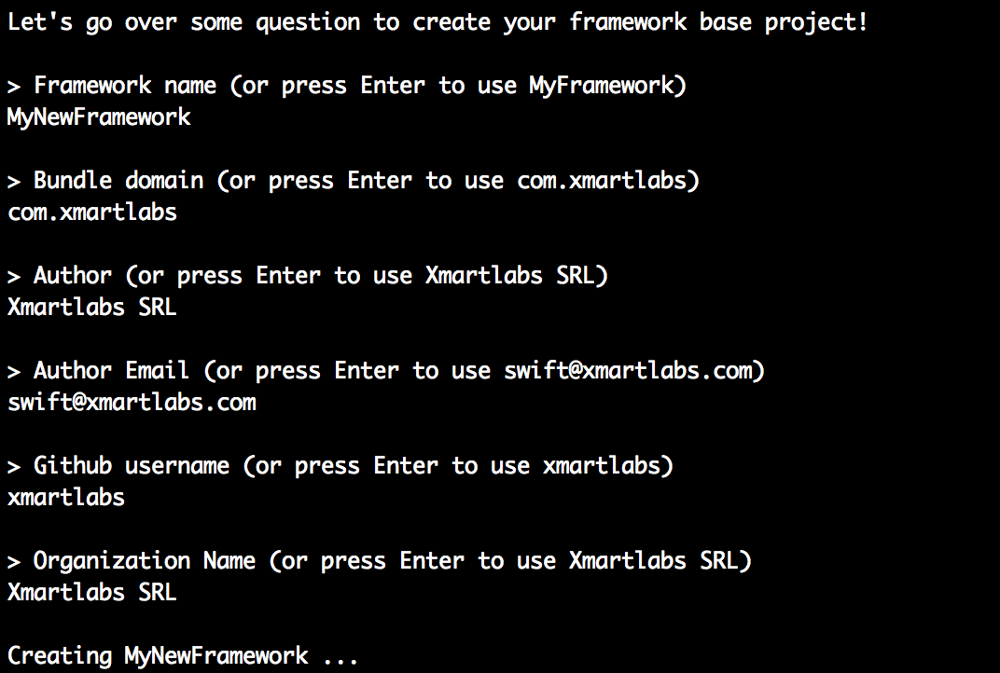

# Swift Framework Template

[](https://travis-ci.org/xmartlabs/Swift-Framework-Template)

Swift script to easily create Swift frameworks! Speed up your iOS OSS library creation time!

At Xmartlabs we've been doing Open Source since our beginning and we ❤️ it. Creating a successful open source project involves many tasks, obviously the most important is to have a well designed, problem specific library that is worth using and helps the community save a lot of development time.

Typically we begin by creating a well structured Xcode workspace, which means it should have a framework project along with its unit test target, an Example project, a Playground file to play with the library among other things. Also, the schemas must be shared to be able to run tests on travis CI.

There are many other tedious tasks to do before getting ready to start the core library code, which is what really matters.
* Set up travis (`.travis.yml`) to automatically build the project and run its tests.
* Create a `CHANGELOG.md` file. There probably won't be much to add about the first library version but it's a good practice to have one from the beginning.
* `CONTRIBUTING.md` file to provide a contributing guideline.
* Add a MIT license file ;).
* Set up git environment by adding a `.gitignore`, setting up the git remote url and making the first commit.
* Provide cocoapods support by creating a podspec file.

Apart of saving a lot of time it's important for us to be consistent on how our team creates open source libraries regardless of who does it.


#### Let's see how *Swift Framework Template* comes in handy when we are about to start a new iOS OSS project.

*Swift Framework Template* is nothing else than a shell script written in swift that asks for library data information to rename folders and replace internal files content of a library template project. For further info look into the [script](shell.swift) details.

##### Usage

Clone the repository:
```shell
 git clone git@github.com:xmartlabs/Swift-Framework-Template.git
 ```
Run `shell.swift` script from there:

```swift
swift -target x86_64-apple-macosx10.12 Swift-Framework-Template/shell.swift
```

Answer the questions:

 

We are done! Now start coding your library! 🍻🍻
